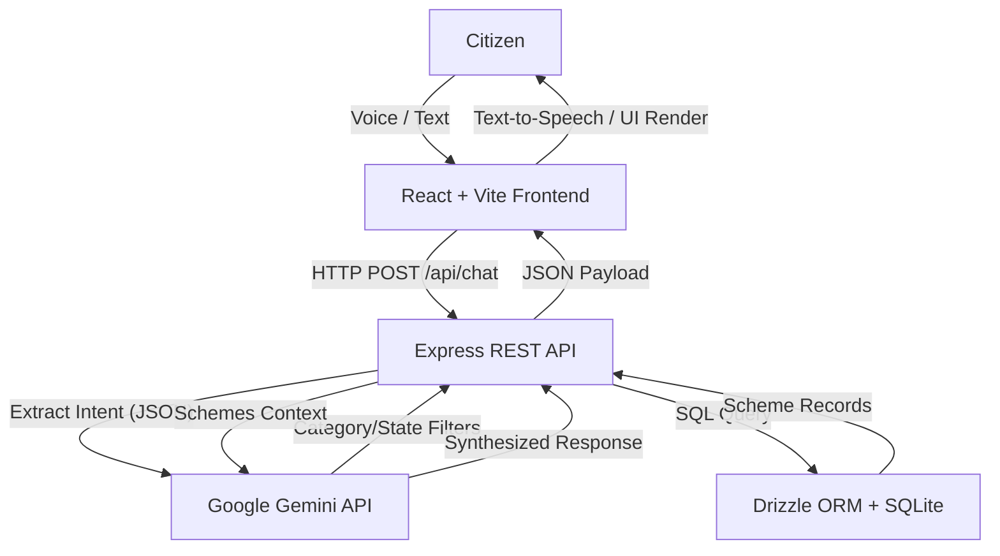

# 🇮🇳 Bharath Scheme Bot

> **AI-powered multilingual government scheme discovery and citizen guidance platform for India.**

[](https://www.typescriptlang.org/)
[](https://reactjs.org/)
[](https://nodejs.org/)
[](https://www.sqlite.org/)
[](https://orm.drizzle.team/)
[](https://ai.google.dev/)
[](https://opensource.org/licenses/MIT)

---

## ⚠️ Important Disclaimer

**Bharath Scheme Bot is an independent informational and guidance application. It is not an official Government of India portal, department, or government service.**

Eligibility information provided by the application is indicative and should always be confirmed using the official scheme source. Users should submit applications only through official government channels and websites linked within the application. 

---

## 📑 Table of Contents

- [Overview](#-overview)
- [Problem Statement](#-problem-statement)
- [Motivation](#-motivation)
- [Solution](#-solution)
- [Key Features](#-key-features)
- [Target Users](#-target-users)
- [User Journey](#-user-journey)
- [How The System Works](#-how-the-system-works)
- [System Architecture](#-system-architecture)
- [AI & Conversational Intelligence](#-ai--conversational-intelligence)
- [Eligibility Engine](#-eligibility-engine)
- [Recommendation Engine](#-recommendation-engine)
- [Multilingual Architecture](#-multilingual-architecture)
- [Scheme Data Architecture](#-scheme-data-architecture)
- [Data Quality & Verification](#-data-quality--verification)
- [Database Architecture](#-database-architecture)
- [API Reference](#-api-reference)
- [Technology Stack](#-technology-stack)
- [Project Structure](#-project-structure)
- [Installation & Setup](#-installation--setup)
- [Development](#-development)
- [Testing & Production Build](#-testing--production-build)
- [Security](#-security)
- [Privacy](#-privacy)
- [Accessibility](#-accessibility)
- [Performance & Reliability](#-performance--reliability)
- [Trust Model](#-trust-model)
- [Known Limitations](#-known-limitations)
- [Roadmap](#-roadmap)
- [Contributing](#-contributing)
- [License](#-license)

---

## 📖 Overview

Bharath Scheme Bot is a comprehensive web platform designed to bridge the gap between Indian citizens and government welfare programs. It acts as an intelligent, multilingual digital assistant that simplifies the often complex process of discovering, understanding, and tracking government schemes.

For **general users**, the platform offers a conversational chat interface where they can speak or type their queries in their native language (e.g., Hindi, Kannada) and receive empathetic, accurate guidance tailored to their personal profile.

For **technical readers**, the platform is a modern Full-Stack TypeScript application leveraging React, Node.js, SQLite with Drizzle ORM, and the Google Gemini AI API to provide semantic intent detection and natural language generation, grounded by a structured relational database.

---

## 🚨 Problem Statement

Navigating government welfare schemes in India presents several formidable challenges for citizens:
- **Fragmented Information:** Details about schemes are scattered across hundreds of distinct Central and State government portals.
- **Language Barriers:** Most official documentation is heavily reliant on English or formal Hindi, alienating citizens who speak regional languages.
- **Complex Eligibility:** Understanding if one qualifies for a scheme involves decoding dense legal and bureaucratic terminology.
- **Application Confusion:** Knowing *how* to apply and *what documents* are needed is often unclear.

---

## 💡 Motivation

The core motivation behind Bharath Scheme Bot is simple:
**Citizen Need → Information Complexity → Language Barrier → AI-Assisted Guidance → Simplified Discovery**

The objective is to make government welfare information accessible, understandable, and actionable for every Indian citizen, regardless of their language or technical literacy, without attempting to replace official government sources.

---

## 🎯 Solution

We provide a frictionless, end-to-end platform where users can:
1. Ask questions naturally via voice or text in multiple Indian languages.
2. Receive accurate scheme recommendations based on a structured database.
3. Assess their eligibility through an interactive profile wizard.
4. Save relevant schemes to a personal "Digital Locker".
5. Track application statuses and export scheme details to PDF for offline reference.

---

## ✨ Key Features

### 🗣️ Multilingual Intelligence
- **Native Localization:** Full support for English, Hindi, Kannada, Tamil, and Telugu.
- **Voice Support (Web Speech API):** Seamless Speech-to-Text for dictating queries and Text-to-Speech (Read Aloud) for having bot responses read back to the user.
- **Cross-Lingual Search:** Users can query in their native language and the AI seamlessly matches it against English-stored database categories.

### 🧠 AI Assistant
- **Intent Detection:** Analyzes unstructured user queries to extract semantic intent (greeting vs. scheme query) and precise filters (Category, State, Source).
- **Grounded Responses:** Synthesizes human-readable responses strictly using context from retrieved database records, preventing AI hallucination.
- **Smart Follow-ups:** Automatically generates contextual follow-up questions to keep the conversation flowing.

### 🔎 Scheme Discovery
- **Rich Catalog:** Browse over 60+ seeded schemes across categories like Agriculture, Education, Health, and Housing.
- **Smart Filtering:** Filter by State (e.g., Karnataka, UP), Category, and Source (Central vs State).

### 🎯 Eligibility & Recommendations
- **Interactive Profile Wizard:** Users can voluntarily provide details (Age, Income, Occupation, State) to build a frictionless profile.
- **Profile-Based Ranking:** The recommendation engine elevates schemes that best match the user's saved profile attributes, streamlining discovery.

### ❤️ Digital Locker (Saved & Tracked)
- **Save Schemes:** Bookmark schemes for later review.
- **Application Tracker:** Move schemes to an application pipeline, tracking statuses like "Interested," "Applied," or "Approved."
- **PDF Export:** Download offline-ready PDFs containing complete scheme details, eligibility criteria, and document checklists.

### 📊 Admin Dashboard
- **Live Metrics:** Real-time visibility into Total Users, Active Applications, and Saved Schemes via the `/admin` interface.

---

## 👥 Target Users

The platform is designed to assist:
- **Farmers** seeking agricultural subsidies and equipment loans.
- **Students** looking for national and state-level scholarships.
- **Women** looking for empowerment, maternal health, and financial independence schemes.
- **Senior Citizens** searching for pension and healthcare benefits.
- **Entrepreneurs & Job Seekers** exploring MSME loans and skill development programs.

---

## 🛤️ User Journey

```text
Open Bharath Scheme Bot
        ↓
Select Language (En/Hi/Kn/Ta/Te)
        ↓
Speak/Type Query (e.g., "I need a tractor loan")
        ↓
AI Intent Detection & Parameter Extraction
        ↓
Structured Database Retrieval
        ↓
AI Synthesizes Grounded Response + Follow-ups
        ↓
User Views Recommended Schemes
        ↓
Completes Profile Wizard (Eligibility)
        ↓
Saves Scheme to Digital Locker
        ↓
Exports PDF & Applies via Official Portal
```

---

## ⚙️ How The System Works

1. **Citizen Input:** User types or speaks a query in the UI.
2. **AI Intent Processing:** The Express backend sends the raw query to Google Gemini, which executes a structured prompt to classify the intent (`scheme_query`) and extract parameters (e.g., `Category: Agriculture`).
3. **Scheme Retrieval:** The backend performs a relational query on the SQLite database using Drizzle ORM based on the extracted parameters.
4. **Ranking:** The retrieved schemes are re-ordered against the user's stored demographic profile.
5. **AI Synthesis:** The top database results are injected back into Gemini as context. Gemini synthesizes a localized, conversational response.
6. **Delivery:** The localized response, along with structured scheme JSON data, is returned to the React frontend.

---

## 🏛️ System Architecture



### Frontend Architecture
- **React 18:** Functional components with Hooks.
- **Vite:** Lightning-fast HMR and optimized production builds.
- **Wouter:** Lightweight client-side routing.
- **React Query:** Efficient data fetching, caching, and state synchronization.
- **Tailwind CSS & Shadcn UI:** Utility-first styling and accessible, reusable UI components.

### Backend Architecture
- **Node.js & Express:** Robust REST API framework.
- **Drizzle ORM:** Type-safe database queries and migrations.
- **SQLite:** Lightweight, disk-based relational database.
- **Google GenAI SDK:** Direct integration with Gemini 2.5 Flash for rapid LLM inference.

---

## 🤖 AI & Conversational Intelligence

- **Intent Detection:** AI acts as a sophisticated semantic router. Instead of relying on rigid keyword matching, Gemini dynamically maps queries like "paisa for college" to the `Education & Students` category.
- **Grounding (RAG-lite):** The AI is strictly instructed to answer questions *only* using the scheme context injected from the database. It is forbidden from inventing schemes (hallucination).
- **Safety Fallback:** If `GEMINI_API_KEY` is missing or the API rate limits, the system seamlessly degrades to a deterministic, RegEx-based keyword matching engine to ensure uninterrupted service.

---

## 🎯 Eligibility Engine & Recommendation

The system employs a **Rule-based Profile Matching Engine**. 
When a user submits their profile via the Eligibility Wizard, the engine (located in `server/engine.ts`) calculates a relevance score for each retrieved scheme by intersecting the user's demographic data (State, Occupation, Age, Income) with the scheme's categorical metadata. 
*Note: This generates a relevance ranking, not a legally binding government eligibility decision.*

---

## 🌐 Multilingual Architecture

Multilingual support is achieved natively through the LLM. 
1. The frontend manages user language state (`language: 'hi'`).
2. The language preference is passed via the API payload.
3. The AI prompt explicitly enforces the output language: *"The user is asking a question in language code: hi. You MUST respond in that language."*
4. Client-side features (like UI labels and Web Speech API voices) dynamically switch to match the active locale (e.g., `hi-IN`).

---

## 📦 Scheme Data Architecture

The SQLite schema (`shared/schema.ts`) heavily structures scheme data:
- `name`, `category`, `source` (Central/State), `state`
- `description`, `eligibility`, `benefits`, `documents`, `applicationProcess`
- `officialLink`

All relational entities (Users, Profiles, Saved Schemes, Applications) are strictly tied via Foreign Keys with cascading safety.

---

## 🛡️ Data Quality & Verification

The database is seeded with over 60 verified schemes mapped from official portals (e.g., PM Kisan, Post Matric Scholarship). 
All data is stored locally in the SQLite database, ensuring instant retrieval. While the platform strives for accuracy, users are always directed to the `officialLink` to verify the latest cutoff dates and policy changes.

---

## 🗄️ Database Architecture

The project uses a highly optimized SQLite database managed by Drizzle ORM.
Key indexes have been established to guarantee performance at scale:
- `users(deviceId)` - Frictionless auth lookup
- `schemes(category)`, `schemes(state)`, `schemes(source)` - Optimized search
- Foreign key constraints between `users` and `savedSchemes` / `applications`.

---

## 🔌 API Reference

| Method | Endpoint | Purpose |
|--------|----------|---------|
| `POST` | `/api/chat` | Main conversational endpoint. Accepts `{ message, language }`. Returns AI response, intent, and matched schemes. |
| `GET`  | `/api/schemes` | Retrieve scheme catalog. Supports `?category=`, `?state=`, `?search=`. |
| `GET`  | `/api/schemes/:id` | Fetch specific scheme details by ID. |
| `POST` | `/api/profile` | Upsert the user's eligibility profile details. |
| `GET`  | `/api/schemes/saved` | Fetch schemes saved to the user's Digital Locker. |
| `POST` | `/api/schemes/saved` | Save a scheme to the Digital Locker. |
| `DELETE`| `/api/schemes/saved/:schemeId` | Remove a saved scheme. |
| `POST` | `/api/applications` | Start an application tracker for a scheme. |
| `PATCH`| `/api/applications/:id/status` | Update the status of a tracked application. |
| `GET`  | `/api/admin/metrics` | Retrieve live system KPIs (Total Users, Apps, Saved). |

---

## 🛠️ Technology Stack

| Layer | Technology | Purpose |
|-------|------------|---------|
| Frontend | React 18 | Declarative UI |
| Build Tool | Vite | Lightning-fast development & bundling |
| Language | TypeScript | End-to-end type safety |
| Backend | Node.js / Express | Robust RESTful API |
| Database | SQLite | File-based relational persistence |
| ORM | Drizzle ORM | Type-safe SQL schema & migrations |
| AI | Google Gemini SDK | Intent parsing & NLG |
| Styling | Tailwind CSS | Utility-first responsive design |

---

## 📂 Project Structure

```text
├── client/
│   ├── src/
│   │   ├── components/    # Reusable UI (SchemeCards, Navigation, Wizard)
│   │   ├── hooks/         # React hooks (useSpeech, useChat)
│   │   ├── lib/           # Utilities (Tailwind merge, QueryClient)
│   │   ├── pages/         # Page routes (Home, SchemesList, Dashboard, Admin)
│   │   └── App.tsx        # Main application router
├── server/
│   ├── ai.ts              # Gemini API integrations and fallback logic
│   ├── db.ts              # SQLite database connection setup
│   ├── engine.ts          # Profile-based recommendation ranking logic
│   ├── index.ts           # Express server entry point
│   ├── routes.ts          # API Route definitions
│   └── storage.ts         # Database operations and query builders
├── shared/
│   └── schema.ts          # Drizzle ORM schema, Types, and Zod validators
├── .env.example           # Environment variables template
├── package.json           # Project dependencies & scripts
└── tsconfig.json          # TypeScript compiler configuration
```

---

## ⚙️ Environment Configuration

Copy the example environment file:
```bash
cp .env.example .env
```

| Variable | Required | Purpose | Example |
|----------|----------|---------|---------|
| `GEMINI_API_KEY` | No* | Enables AI intent parsing and response generation. | `AIzaSy...` |
| `PORT` | No | Overrides default API port (5000). | `5000` |

*\*If `GEMINI_API_KEY` is omitted, the application will run seamlessly in RegEx Fallback mode.*

---

## 🚀 Installation & Setup

**Prerequisites:** Node.js (v20+ recommended).

1. Clone the repository:
```bash
git clone https://github.com/Nireeksha2317/bharath-scheme-bot-multilingual-ai-guide.git
cd bharath-scheme-bot-multilingual-ai-guide
```

2. Install dependencies:
```bash
npm install
```

3. Setup the database (creates tables and applies indexes):
```bash
npm run db:push
```

---

## 💻 Development

Start the development server (runs both Vite frontend and Express backend concurrently):

```bash
npm run dev
```

The application will be accessible at `http://localhost:5000`. 
*Note: The SQLite database automatically seeds 60+ schemes on the first boot if the `schemes` table is empty.*

---

## 🧪 Testing & Production Build

To verify type safety across the entire Full-Stack codebase:
```bash
npm run check
```

To compile the application for production deployment:
```bash
npm run build
```
This command bundles the React frontend via Vite, places the static assets in the `dist/public` folder, and compiles the Express backend to serve them.

---

## 🔒 Security

- **Frictionless Auth:** Uses a UUID (`deviceId`) generated locally and stored in `localStorage` to create anonymous user sessions, protecting citizen identity.
- **SQL Injection Protection:** All database operations utilize Drizzle ORM's parameterized queries, entirely neutralizing SQL injection vulnerabilities.
- **AI Prompt Safety:** The Gemini system prompt strictly defines the scope of responses, forcing it to only use provided database context to prevent prompt injection or hallucination.

---

## 🕵️ Privacy

Bharath Scheme Bot operates on a **Privacy-First** architecture.
- **No PII Required:** Citizens are never forced to provide their Name, Phone Number, or Aadhaar number to use the platform.
- **Voluntary Profiles:** Data provided to the Eligibility Wizard (Age, State, Income) is tied to the anonymous `deviceId` and is solely used to rank scheme relevance.

---

## ♿ Accessibility

- **Web Speech API:** Complete integration for voice-in (dictation) and voice-out (TTS Read Aloud) to support users with low literacy or visual impairments.
- **Responsive UI:** Tailored layout for mobile devices (where the majority of Indian citizens access the internet).
- **High Contrast:** Supports deep Dark Mode out of the box via Tailwind styling.

---

## ⚡ Performance & Reliability

- **Graceful AI Degradation:** If the LLM goes offline or rate-limits, the system falls back to a deterministic RegEx engine, ensuring zero downtime for the user.
- **SQLite Indexing:** Strategic database indexes (`deviceIdIdx`, `scheme_category_idx`) ensure instantaneous queries even as the scheme database grows.
- **React Query:** Aggressively caches API responses on the frontend to minimize redundant network payloads.

---

## 🤝 Trust Model

It is vital to understand the separation of concerns:
- **Database = Structured Information:** Ground truth sourced from official portals.
- **Eligibility Engine = Rule-based Filtering:** Narrows down relevant schemes based on user profile.
- **AI = Conversational Interface:** Explains the data empathetically and translates it.
- **Official Government Source = Final Authority:** The platform always directs the user to the official portal for final submission.

---

## 🚧 Known Limitations

- **Indicative Eligibility:** The platform computes *potential* eligibility. Only the official government authorities can issue final approvals.
- **API Dependencies:** Multilingual conversational fluidity relies heavily on the availability of the Google Gemini API.
- **Voice Support Compatibility:** The Web Speech API's accuracy and supported voices depend entirely on the user's browser and operating system (Chrome/Android provide the best experience for Indian languages).

---

## 🗺️ Roadmap

**Planned Improvements & Future Possibilities:**
- [ ] Integration with official government open APIs (where available) for real-time scheme status syncing.
- [ ] Expansion of native UI language toggles to include Bengali, Marathi, and Gujarati.
- [ ] Implementation of a dedicated Admin UI for dynamically creating and editing schemes without touching the seed file.
- [ ] Automated SMS/WhatsApp notifications for tracked application reminders.

---

## 🛠️ Contributing

Contributions are welcome! Please follow these steps:
1. Fork the repository.
2. Create your feature branch (`git checkout -b feature/AmazingFeature`).
3. Commit your changes (`git commit -m 'Add some AmazingFeature'`).
4. Ensure all type checks pass (`npm run check`).
5. Push to the branch (`git push origin feature/AmazingFeature`).
6. Open a Pull Request.

---

## 📄 License

This project is licensed under the **MIT License**. See the LICENSE file for details.

---
*Made with ❤️ for the citizens of India.*
